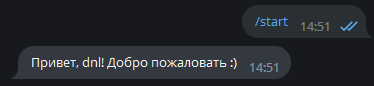
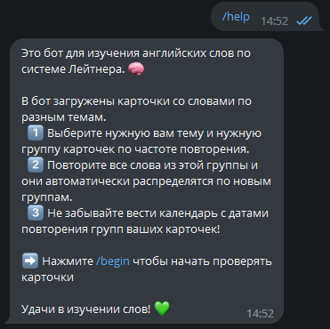
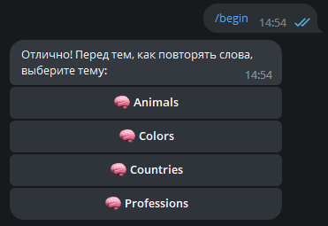
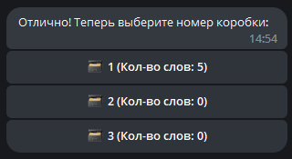
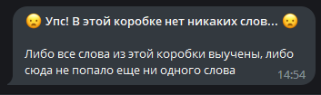
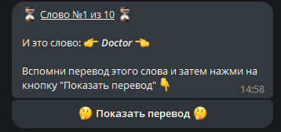
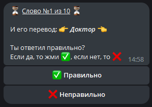
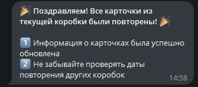
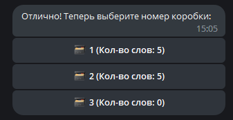

# Бот для изучения иностранных языков по системе Лейтнера
## Пьянков Даниил https://t.me/pyankovdaniil

Ссылка на объяснение работы системы Лейтнера: https://en.wikipedia.org/wiki/Leitner_system

Телеграм-бот принимает 3 команды:
1. /start - по этой команде бот пишет приветственное сообщение и ником пользователя

2. /help - по этой команде выводится руководство о том, как пользоваться ботом

3. /begin - по этой команде начинается повторение слов по теме из одной из трех коробок. После этого бот предлагает 
   выбрать тему, по которой будут повторяться слова (каждая тема - это отдельный файл в resources/themefiles, при 
   перезапуске бота он автоматически обновляет все темы, и если была добавлена новая, слова из нее попадут в базу 
   данных и тема будет видна в выборе у пользователя)

После выбора темы предлагается выбор коробки, причем сразу видно сколько слов находится в каждой коробке

Если выбрать коробку, в которой нет ни одного слова, выведется следующее сообщение

Если же выбрать коробку со словами, то начнется повторение. Для каждого слова из этой коробки сначала будет показано 
   само слово на английском и кнопка "Показать перевод". Также будет показан счетчик, то есть можно понять, сколько 
   слов уже повторено, и сколько слов осталось

После нажатия кнопки "Показать перевод" будет показан перевод и 2 кнопки - "Правильно" и "Неправильно". 
   Соответственно, если пользователь правильно вспомнил перевод этого слова, то слово попадет в следующую коробку 
   этой темы, а если неправильно, то в предыдущую (или останется в этой же, если предыдущей или следующей коробки 
   нет)

! Важно: все карточки показываются в одном сообщении, то есть это сообщение редактируется, а не присылается новое 
   для каждой карточки.

После того, как все карточки из коробки были повторены, выведется следующее сообщение:

И если снова выбрать эту тему, то можно увидеть, сколько слов попало в следующую коробку (так как изначально все 
   слова находятся в 1 коробке, и допустим, пользователь ответил 5 правильно и 5 неправильно, то 5 слов попадут 
   дальше, а 5 останутся в первой коробке)

